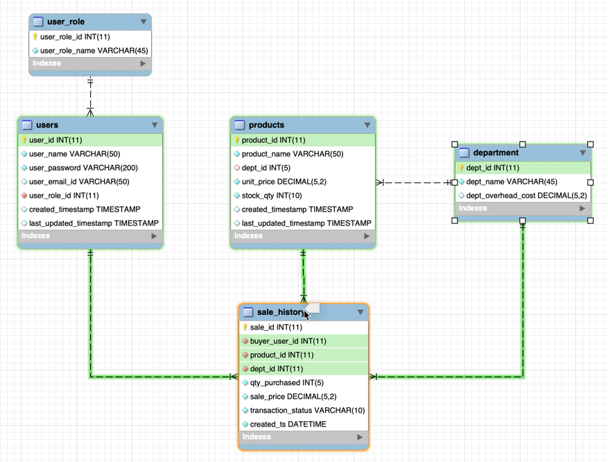

# Bamazon

Bamazon is an CLI shopping app built using node.js and MySQL as the database.
The app is being built in 4 phases with below functionalities.
1. User Login Validation
    The database stores encrypted passwords and the credentials entered by the user is validated and their role determined.

2. Customer View
    Displays a product catalogue to the customer and allows them to purchase items off the catalogue. If the store has enough
    inventory to fulfill the order, customer is given a receipt and product stock count decremented. If sufficient inventory
    is not available, it intimates the customer appropriately.
    Even unfufilled sale transactions are recorded for future analytics.

### Upcoming Releases

3. Manager View
   Allows a manager to generate reports on top selling items, low inventory items, departments with poor order fulfillment rate etc
   Also allows a manager to add a new product or update an existing product's price, stock quantity etc

4. SUPERVISOR View
   Allows supervisor to generate profit-loss report by department

## Instructions to Setup the project

1. Run the dbscrippt.sql to create the databases and tables
2. Run the dbseeds.sql to setup initial data
3. Setup the db details in .env file (dbname and dbpassword,)

## DEMO of the current version of app is below

## ER diagram showing the database design is also provided:

## Known Issues:

1. Validation for price input. Current price field can hold a max of 999.99.
   Need to add a validation if user enter a larger amount

2. Validation for number fields in user input (Quantity to be purchased etc)
